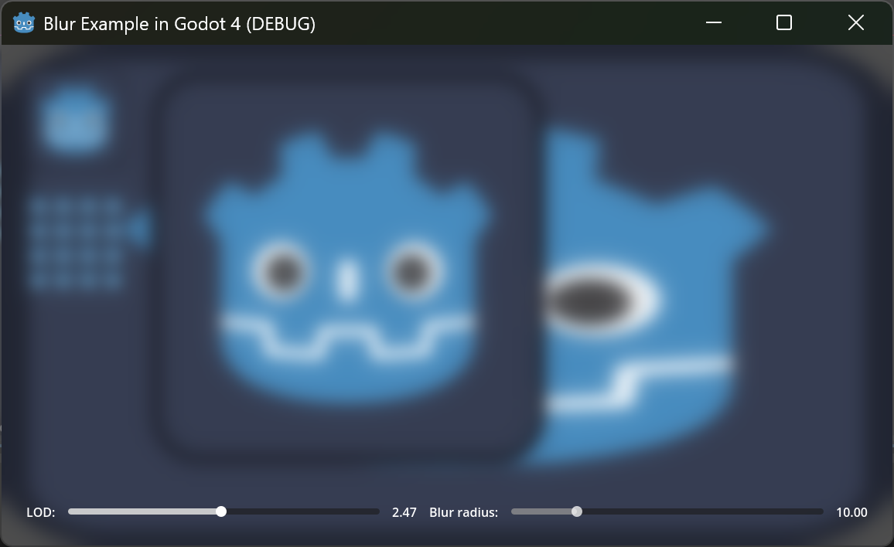

Demo for Gaussian and LOD blur in Godot
=======================

This is an example of a shader for Gaussian blur in Godot 4 and comparison with LOD-based blur.

Gaussian blur works in two passes: first horizontal (X) then vertical (Y). Linear texture filtering is used to cut the number of required texture samples in two. [This article](https://www.rastergrid.com/blog/2010/09/efficient-gaussian-blur-with-linear-sampling/) describes both techniques in detail.

The shader `Blur.gdshader` was generated by the editor script `ShaderGenerator.gd`. This script hardcodes a fixed blur radius into the shader, which can be configured by editing the script. The larger the radius, the more texture samples, and the greater the performance cost.

The radius _can_ be adjusted at runtime with a shader uniform, but this has a few caveats:

1. Choosing a smaller radius does _not_ reduce the number of texture lookups, so it does _not_ improve performance. If you need a blur of a different, fixed radius, it's recommended to generate a different shader for that instead. If you need to turn off the blur, you should just turn off the shader.

2. Choosing a larger radius than what the shader was designed for will result in artifacts, because the shader will start skipping pixels.

3. The linear texture filtering trick is probably not 100% mathematically correct anymore, although visually this doesn't seem to matter.

As such, runtime radius adjustment is mostly useful for fading the shader's effect in and out.

# Why I forked

Wanted to simplify the use of this blur and compare with LOD blur. For now, I got rid of the viewports and the blur is just one node you can apply whereever now. It blurs everything below. Next up, I wanna streamline changing the radius in ShaderGenerator and generate new shaders on the fly. Maybe make a crude but effecient live-preview using LODs. 
